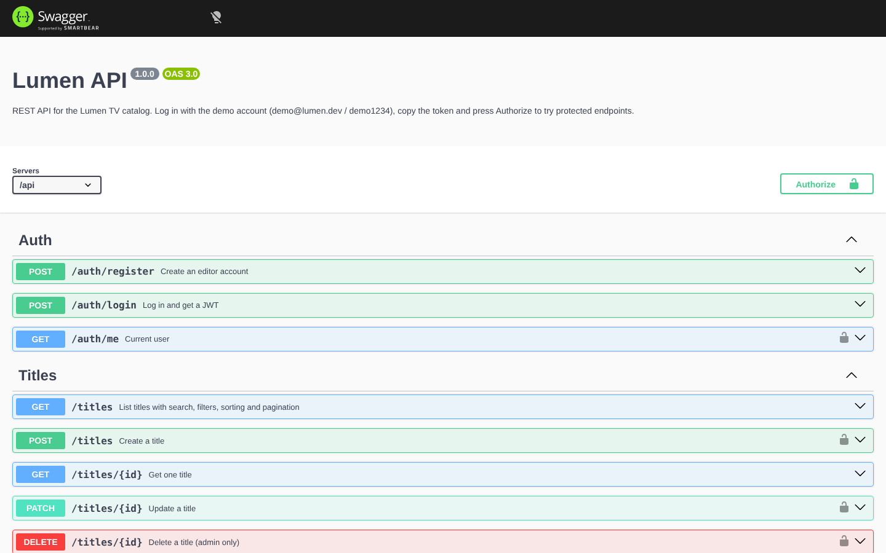

# Lumen API

REST API for the [Lumen TV](https://github.com/guluaketi11/lumen-tv) catalog, built with Node.js, Express and TypeScript.

**Live docs:** _add your Render link here_/docs



## Features

- **JWT authentication.** Register, log in, get the current user. Passwords are hashed with bcrypt and never returned.
- **Roles.** Editors can create and update titles. Only admins can delete them.
- **Titles CRUD** with search, genre and status filters, sorting and pagination.
- **Catalog stats** aggregated in the database with Sequelize (`fn`/`col` + `GROUP BY`).
- **Validation with Zod.** Every request body and query is validated, with field-level error messages.
- **Consistent errors.** Every error has the same JSON shape: `{ "error": { "code", "message", "details" } }`.
- **Interactive API docs.** OpenAPI 3 spec with Swagger UI at `/docs`.
- **Tests.** 15 integration tests with Vitest and Supertest, running against an in-memory database.
- **SQLite locally, PostgreSQL in production.** Set `DATABASE_URL` and the same code runs on Postgres.

## Endpoints

| Method | Path | Auth | Description |
| --- | --- | --- | --- |
| POST | `/api/auth/register` | | Create an editor account |
| POST | `/api/auth/login` | | Log in and get a JWT |
| GET | `/api/auth/me` | ✓ | Current user |
| GET | `/api/titles` | | List titles (`search`, `genre`, `status`, `sort`, `page`, `limit`) |
| GET | `/api/titles/:id` | | Get one title |
| POST | `/api/titles` | ✓ | Create a title |
| PATCH | `/api/titles/:id` | ✓ | Update a title |
| DELETE | `/api/titles/:id` | admin | Delete a title |
| GET | `/api/stats` | | Totals, views by genre, titles by status |

Example:

```bash
curl "http://localhost:3000/api/titles?genre=Fantasy&sort=-views&limit=2"
```

```json
{
  "data": [{ "id": 1, "title": "Sintel", "genre": "Fantasy", "views": 184230 }],
  "meta": { "page": 1, "limit": 2, "total": 3, "pages": 2 }
}
```

Validation error:

```json
{
  "error": {
    "code": "validation_error",
    "message": "Request validation failed",
    "details": [{ "field": "streamUrl", "message": "Must be an HLS (.m3u8) URL" }]
  }
}
```

## Run locally

```bash
npm install
npm run dev
```

The API starts on http://localhost:3000 and opens the docs at `/docs`. The database is created and seeded automatically. Demo admin: `demo@lumen.dev` / `demo1234`.

```bash
npm test        # run the test suite
npm run build   # compile to dist/
npm start       # run the compiled server
```

Configuration lives in environment variables, see `.env.example`.

## Deploy to Render

1. Push this repo to GitHub.
2. On [Render](https://render.com), choose **New → Blueprint** and select the repo. `render.yaml` sets everything up, including a random `JWT_SECRET`.
3. For persistent data, create a Render PostgreSQL database and set its URL as `DATABASE_URL`. Without it, the free instance uses SQLite and reseeds the demo data on every restart.

## Project structure

```
src/
  app.ts            Express app: middleware, routes, docs
  server.ts         Starts the server, syncs and seeds the database
  config.ts         Environment configuration
  db.ts             Sequelize connection (SQLite or PostgreSQL)
  models/           User and Title models
  routes/           auth, titles, stats
  middleware/       auth (JWT, roles), validation, error handling
  schemas.ts        Zod request schemas
  openapi.ts        OpenAPI 3 spec
  seed.ts           Demo admin and catalog
tests/              Vitest + Supertest integration tests
```
